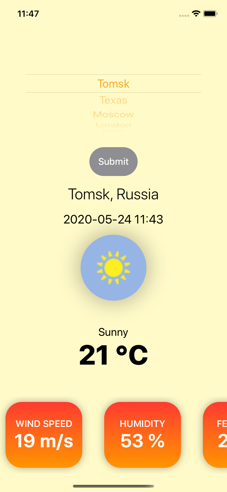
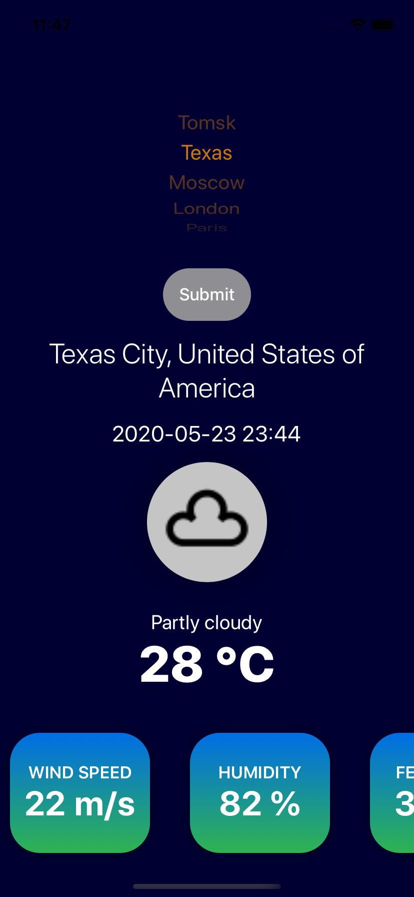
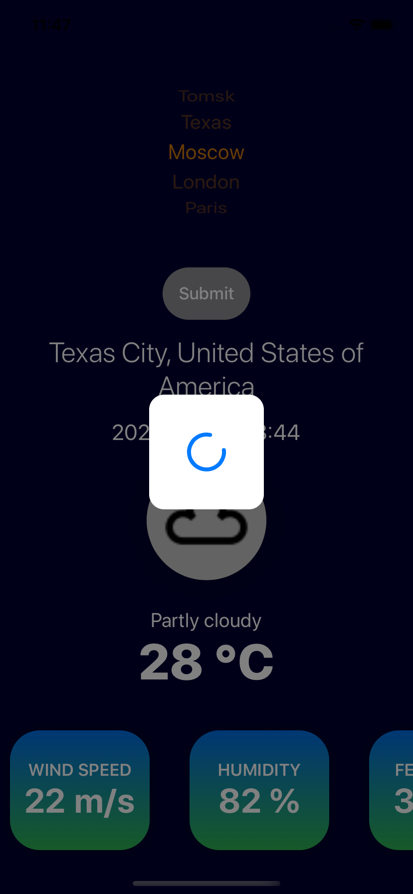

# WeatherSwiftUI

- SwiftUI
- [Alamofire](https://github.com/Alamofire/Alamofire)
- [SwiftyJSON](https://github.com/SwiftyJSON/SwiftyJSON)
- [SDWebImageSwiftUI](https://github.com/SDWebImage/SDWebImageSwiftUI)

## Screens

  
